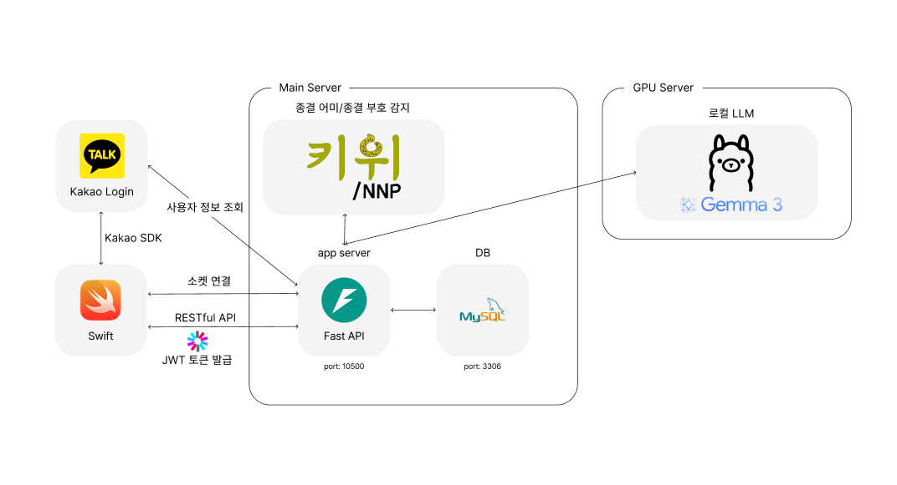
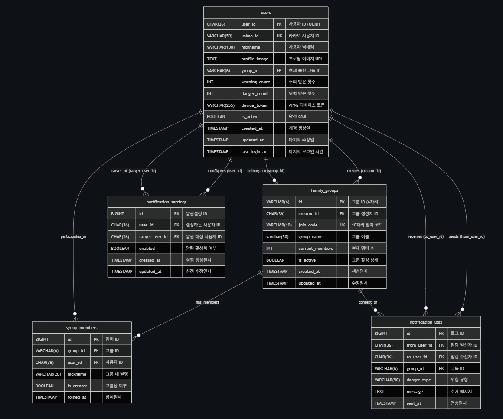

# 위허메, 금융범죄를 예방하는 가장 똑똑한 키보드


<p align="center">
    
</p>
위 급한 판단 실수의 순간!<br />
허 위 정보에 흔들리지 않도록!<br />
메 시지를 감지해! 금융범죄를 예방하는 키보드 기반 서비스<br />

## 시스템 아키텍쳐
<p align="center">
    
</p>

## ERD
<p align="center">
    
</p>

## config 가이드

./app/config.py 파일을 생성 후 sample_config.py 파일을 참고하여 아래 코드와 같이 작성합니다.

```py
from app.sample_config import Config

class Development(Config):
    WEB_HOST = '0.0.0.0'
    WEB_PORT = 서버 포트 번호

    # Ollama
    OLLAMA_URL = 'OLLAMA 서버 주소'
    OLLAMA_MODEL = 'fraud-detector:latest'

    # Push Alarm
    AUTH_KEY_PATH = '.p8 파일 경로'
    TEAM_ID = 'Apple Developer Team ID'
    AUTH_KEY_ID = '.p8 인증 키 ID'
    APP_BUNDLE_ID = '앱의 Bundle ID'
    IS_PRODUCTION = True | False # 프로덕션 환경 여부
```

.env 파일을 생성 후 아래 코드와 같이 작성합니다.

```py
    # Kakao Login Settings
    kakao_token_url=https://kauth.kakao.com/oauth/token
    kakao_auth_url=https://kauth.kakao.com/oauth/authorize
    kakao_userInfo_url=https://kapi.kakao.com/v2/user/me
    kakao_client_url=your_kakao_client_url
    redirect_url=your_redirect_url

    # 새로운 설정들 (호환성)
    KAKAO_CLIENT_ID=your_kakao_client_url
    KAKAO_REDIRECT_URI=your_redirect_url
    KAKAO_ADMIN_KEY=your_kakao_admin_key

    # 프로젝트
    PROJECT_NAME=WatchOut
    APP_BUNDLE_ID=com.jaesuneo.WatchOut
    APP_CUSTOM_SCHEME=watchout

    # MySQL DB
    MYSQL_HOST=127.0.0.1
    MYSQL_PORT=3306
    MYSQL_DATABASE=your_db
    MYSQL_USERNAME=your_username
    MYSQL_PASSWORD=your_pw

    # Legacy MySQL 세팅 (config.py에서 사용)
    MYSQL_SERVER=127.0.0.1
    MYSQL_USER=your_db
    MYSQL_PASSWORD=your_username
    MYSQL_DB=your_pw

    # JWT 세팅
    JWT_SECRET_KEY=your_jwt_secret_key
    JWT_ALGORITHM=HS256
    JWT_ACCESS_TOKEN_EXPIRE_MINUTES=43200 

    # 서버 설정
    SERVER_HOST=0.0.0.0
    SERVER_PORT=8000
    ENVIRONMENT=production

    # 로깅 설정
    LOG_LEVEL=INFO
    SQL_ECHO=false
```

## Ollama 및 Gemma 3:4B 설치 가이드

### 1. Ollama 설치

**Windows:**
```bash
# 1. Ollama 공식 사이트에서 Windows 설치 파일 다운로드
# https://ollama.ai/download/windows

# 2. 다운로드한 .exe 파일 실행하여 설치

# 3. 설치 완료 후 명령 프롬프트/PowerShell에서 확인
ollama --version
```

**macOS:**
```bash
# 1. Homebrew를 사용한 설치
brew install ollama

# 2. 또는 공식 사이트에서 .dmg 파일 다운로드
# https://ollama.ai/download/mac
```


### 2. Gemma3 4B 모델 설치

```bash
# Ollama 서비스 시작
ollama serve

# 새 터미널에서 Gemma 3 4B 모델 다운로드 및 설치
ollama pull gemma3:4b

# 설치 확인
ollama list

# 모델에 System prompt 통합
ollama create fraud-detector -f ./Modelfile
```


## 실행법

```sh
python -m app
```

